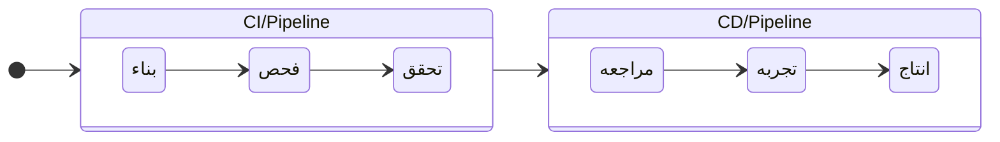

> [!tip] ##  الدمج المستمر `(CI)Continuous Integration`
> الدمج المستمر او التكامل المستمر هو نشر الكود المكتوب من الفريق في مستودع واحد `shared repository` مما يحسن من خطوات تقديم اصدار جديد `deployment pipeline`
> > [!danger] `deployment pipeline` 
> > سلسلة من الخطوات التي يجب القيام بها من أجل تقديم إصدار جديد من البرنامج.
> 
> -  المبرمج يشارك الكود عن طريق طلب دمج `merge/pull request`
> - بعد طلب الدمج سلسه من الخطوات `CI pipeline/pipeline` تبدا وهي 
> 	  1. بناء `build` 
> 	  2.فحص  `test` مثال `unit test`
> 	  3. تحقق `validate` مثال `integration test`
> - بعد نهايه الخطوات يتم الدمج في مستودع الكود الخاص بالفريق
 

---
> [!tip] ##  التسليم المستمر `(CD)Continuous Delivery` 
> بعد خطوه الدمج المستمر`CI` في هذه المرحله يتم تسليم و بناء التطبيق, في حال حدوث اي تغيير في قاعده الكود `codebase` ينشر التطبيق مع التغيير بنفس الوقت
> - النشر `deployment` في التسليم المستمر يحدث يدويا
>  - يتطلب تدخل انسان لـ نشر التغيير
>  - `CD pipeline:`
> 	 1. مراجعه 
> 	 2. تجربه او بروفه `staging`
> 	 3. انتاج `production`

---
> [!tip] ##  النشر المستمر `Continuous Deployment` 
> هذه الخطوه ايضا بعد الدمج المستمر `CI` و تختلف عن التسليم المستمر `CD` فقط من ناحيه النشر يحدث تلقائيا

---
## مثال على سير العمل الخاص بـ `CI/CD`

`بالعربي:`

`بالانجليزي:`

![[Pasted image 20230718202238.png]]

---
## لماذا نستخدم `CI/CD`
1. سرعه اكتشاف الاخطاء في الدمج المستمر `CI`
2. سرعه الحصول على تعليقات المستخدمين بسبب استخدام التسليم المستمر `CD`
3. قله المشاكل في الدمج المستمر `CI` بسبب قله حجمها و ضمان عدم تراكمها 
4. قله المخاطره في اصدار نسخ جديده من التطبيق بسبب التسليم المستمر `CD`
5. سرعه البرمجه و كثره المخرجات بسبب الدمج المستمر `CI`

---
## عناصر اساسيه في `gitlab CI/CD`

> [!question] `YAML file`
> ملف يتم كتابه  سلسلة من الخطوات `pipeline`
> - يسمى `gitlab-ci.yml` في `gitlab`
> - يسمى `workflow.yml` في `github` و يكون مثل القالب الجاهز
> 	- مثال عليها `Node.js by GitHub Actions`
> 
> المزيد من المعلومات: https://learnxinyminutes.com/docs/yaml/

> [!question] الساعي `gitlab runner`
> ملف مكتوب بلغه `Go` وظيفته ينفذ `pipeline` المكتوب بـ `YAML`
> - مدير `gitlab` بمكانه ان يجعل الساعي `gitlab runnder` مشترك بين المشاريع او خاص بمشروع اخر
> - انواع الساعي `gitlab runner`
> 	1. ساعي مشترك `shared runner`: متاح للجميع
> 	2. ساعي محدد `specific runner`: غالبا متاح ل مشروع واحد 
> 	3. ساعه لمجموعه `group runner`: متاح للمجموعه
> 
> في `github`  يوجد ساعي يسمى `self-hosted runners` لكن في الغالب لا يستخدم الذي يستخدم هو التنفيذ التلقائي: في حال حصل تغيير `push` ينفذ `pipeline` المكتوب بـ `YAML`

